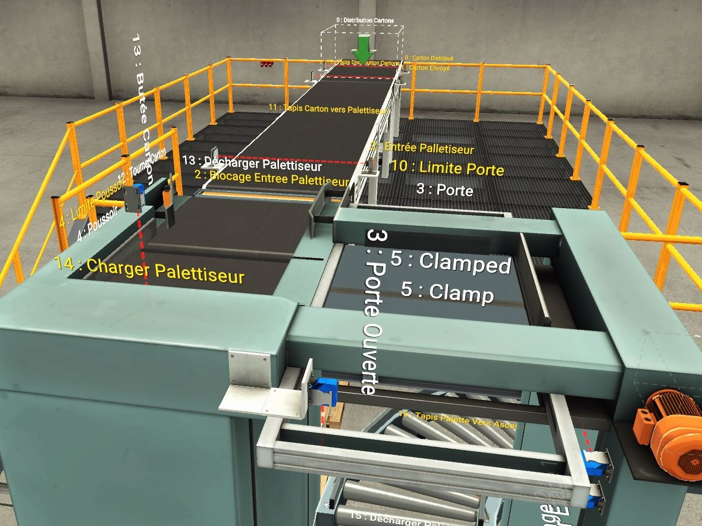

# **Factory I/O Palletizer Control with STM32 and FreeRTOS**



## **Overview**
This project implements the control logic of a **palletizer simulated in Factory I/O** using an **STM32F072 microcontroller** running **FreeRTOS**.  
The microcontroller acts as the main controller of the automation process, exchanging commands and sensor data with a PC running the Factory I/O simulation via **UART communication**.

The project demonstrates:
- Real-time multitasking with **FreeRTOS**.
- Robust **UART-DMA communication** for bidirectional data transfer.
- A modular structure for separating application logic, board support, and communication handling.

---

## **Project Structure**
```
app/
 ├── inc/                # Application headers
 └── src/
      ├── main.c         # Main entry point, task creation, system init
      ├── printf-stdarg.c
      └── stm32f0xx_it.c # Interrupt handlers

bsp/
 ├── inc/
 │     ├── bsp.h         # Board support definitions
 │     ├── delay.h       # Delay utilities
 │     └── factory_io.h  # Communication interface with Factory I/O
 └── src/
       ├── bsp.c
       ├── delay.c
       └── factory_io.c  # UART/DMA communication handlers

cmsis/
FreeRTOS/
TraceRecorder/
```

---

## **System Architecture**

### **Hardware**
- **MCU**: STM32F072RB (ARM Cortex-M0)
- **Communication**: UART2 (TX/RX via DMA)
- **PC Interface**: Factory I/O simulation software
- **RTOS**: FreeRTOS

---

## **Communication Principle**

### **Data Flow**
The STM32 exchanges information with the PC using **UART**:
- **Sensor data (inputs)** are **received** via UART DMA.
- **Actuator commands (outputs)** are **sent** via UART DMA.

This allows **non-blocking, real-time communication** between the embedded system and the simulation.

---

## **UART-DMA Communication**

### **Reception (Sensors)**
- The **DMA controller** continuously listens to incoming UART messages from Factory I/O.
- Received data (sensor states) are **processed in `factory_io.c`**, decoded, and dispatched to tasks through FreeRTOS **queues** or **semaphores**.

### **Transmission (Actuators)**
- When a task needs to activate or deactivate an actuator (e.g., conveyor, lifter, pusher), it sends a **command message** to the communication queue.
- The **`Task_Write()`** function (defined in `main.c`) retrieves the message, formats it, and sends it via **DMA** to the PC.
- Once transmission completes, a semaphore (`xSem_DMA_TC`) signals the end of the DMA transfer.

---

## **FreeRTOS Task Overview**

### **1. `Task_Write()`**
Handles **actuator commands** and UART transmission:
```c
void Task_Write(void *pvParameters);
```
- Waits for messages in `xComQueue`.
- Updates the DMA transmission buffer according to the command.
- Initiates DMA-based UART transmission.
- Waits for transfer completion (via semaphore).

### **2. `vTask1()`**
Simulates the **carton distribution logic**:
```c
void vTask1(void *pvParameters);
```
- Controls conveyor belts and distribution actuators.
- Waits for sensor events (via semaphores and queues).
- Synchronizes with other tasks using notifications (`xTaskNotifyGive`).
- Example: waits until cartons reach the "palletizer entry" sensor, then signals other tasks to continue.

### **3. Other Tasks**
Additional tasks (e.g., `vTask2`, `vTask3`) manage pallet handling, stacking, and synchronization with Task 1 to ensure a coherent automation sequence.

---

## **File Highlights**

### **`factory_io.c`**
- Manages UART and DMA configuration.
- Parses incoming sensor data.
- Builds actuator command frames for transmission.

### **`bsp.c` and `bsp.h`**
- Provide low-level board initialization (clocks, GPIO, UART setup).

### **`main.c`**
- Initializes the RTOS, queues, and semaphores.
- Creates and starts the application tasks.

---

## **Features**
- Real-time control with FreeRTOS  
- Full-duplex UART communication via DMA  
- Modular architecture (BSP / Application / Communication layers)  
- Synchronization using FreeRTOS semaphores and task notifications  
- Simulation coupling with Factory I/O  

---

## **How to Use**
1. **Connect the STM32F072** board to your PC via UART.
2. **Run Factory I/O** and select the **Palletizer Scene**.
3. **Load and flash** the firmware to the STM32 using your IDE.
4. Observe the simulation: the microcontroller sends and receives messages in real time, controlling the entire palletizer cycle.


